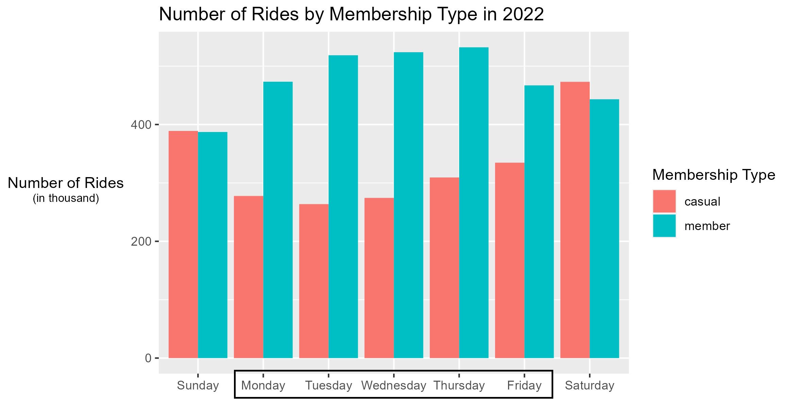

```{css zoom-lib-src, echo = FALSE}
script src = "https://ajax.googleapis.com/ajax/libs/jquery/3.4.1/jquery.min.js"
```

```{js zoom-jquery, echo = FALSE}
 $(document).ready(function() {
    $('body').prepend('<div class=\"zoomDiv\"></div>');
    // onClick function for all plots (img's)
    $('img:not(.zoomImg)').click(function() {
      $('.zoomImg').attr('src', $(this).attr('src')).css({width: '100%'});
      $('.zoomDiv').css({opacity: '1', width: 'auto', border: '1px solid white', borderRadius: '5px', position: 'fixed', top: '50%', left: '50%', marginRight: '-50%', transform: 'translate(-50%, -50%)', boxShadow: '0px 0px 50px #888888', zIndex: '50', overflow: 'auto', maxHeight: '100%'});
    });
    // onClick function for zoomImg
    $('img.zoomImg').click(function() {
      $('.zoomDiv').css({opacity: '0', width: '0%'}); 
    });
  });
```

## Introduction

### Scenario

Welcome to the Cyclistic bike-share analysis case study!


In this case study, I am here as a junior data analyst working in the marketing team at Cyclistic, a fictional bike-share company in Chicago. Lily Moreno, the marketing director, believes that the company's future success depends on maximizing the number of annual memberships.

To ride a Cylcistic bike, you can unlock it from one station and return it to any other station in the system. There are a few pricing plans to purchase:

-   Single-ride passes
-   Full-day passes
-   Annual memberships

Customers who purchase single-ride or full-day passes are referred to as casual riders. Customers who purchase annual memberships are Cyclistic members.

Our task here is to understand how casual riders and annual members use Cyclistic bikes differently. The marketing team will design a new marketing strategy from these insights to convert casual riders into annual members. But, Cyclistic executives must approve your recommendations with compelling data insights and visualization.

<details>

<summary><b>More about company's details</b></summary>

In 2016, Cyclistic launched a successful bike-share offering. Since then, the program has grown to a fleet of 5,824 bicycles that are geo-tracked and locked into a network of 692 stations across Chicago. The bikes can be unlocked from one station and returned to any other station in the system at any time.

Until now, Cyclistic's marketing strategy relied on building general awareness and appealing to broad consumer segments. One approach that helped make these things possible was the flexibility of its pricing plans: single-ride passes, full-day passes, and annual memberships. Customers who purchase single-ride or full-day passes are referred to as casual riders. Customers who purchase annual memberships are Cyclistic members.

Cyclistic's finance analysts have concluded that annual members are much more profitable than casual riders. Although the pricing flexibility helps Cyclistic attract more customers, Moreno believes that maximizing the number of annual members will be key to future growth. Rather than creating a marketing campaign targeting all-new customers, Moreno believes there is a good chance to convert casual riders into members. She notes that casual riders are already aware of the Cyclistic program and have chosen Cyclistic for their mobility needs.

Moreno has set a clear goal: Design marketing strategies aimed at converting casual riders into annual members. In order to do that, however, the marketing analyst team needs to better understand how annual members and casual riders differ, why casual riders would buy a membership, and how digital media could affect their marketing tactics. Moreno and her team are interested in analyzing the Cyclistic historical bike trip data to identify trends.

</details>

### Objectives

Identify how casual and members riders use Cyclists bikes differently to maximize the number of annual memberships.

## Preparation

Here are a few tools used in this analysis:

-   [RStudio](https://posit.co/)
-   The library used in R: `tidyverse`, `ggplot2`, `lubridate`, `readxl`
-   Dataset
    -   [Cyclistic's historical trip data in 2022](https://divvy-tripdata.s3.amazonaws.com/index.html)
    -   [The license](https://www.divvybikes.com/data-license-agreement) has been made available by Motivate International Inc.

## Processing the Data

Here's a step by step of processing raw data to be prepared for analysis:

<details>

<summary><b>Import your data</b></summary>

To connect the data to the R environment, the step as follows:

-   First, download the previous 12 months' Cyclistic trips in .csv format.
-   Second, convert the data from .csv to xlsx format. Store it in a new folder (e.g. "\~/bike-project/xlsx-version")
-   Next, load the library used in this analysis and set the main directory where the data is stored.

```{r STEP 1 - Library included, eval=TRUE, echo=TRUE, message=FALSE, warning=FALSE, paged.print=FALSE}
library(tidyverse)
library(ggplot2)
library(lubridate)
library(readxl)
#setwd("C:/Users/LENOVO/Documents/bike-project/xlsx-version")
#setwd is not used because of web development circumstances
```

-   Using the `readxl` library, load the data and give the name each month.

```{r STEP 1 - Collect Data, eval=TRUE, echo=TRUE, message=FALSE, warning=FALSE, paged.print=FALSE}
m1_2022 <- read_xlsx("C:/Users/LENOVO/Documents/bike-project/xlsx-version/202201-divvy-tripdata.xlsx")
m2_2022 <- read_xlsx("C:/Users/LENOVO/Documents/bike-project/xlsx-version/202202-divvy-tripdata.xlsx")
m3_2022 <- read_xlsx("C:/Users/LENOVO/Documents/bike-project/xlsx-version/202203-divvy-tripdata.xlsx")
m4_2022 <- read_xlsx("C:/Users/LENOVO/Documents/bike-project/xlsx-version/202204-divvy-tripdata.xlsx")
m5_2022 <- read_xlsx("C:/Users/LENOVO/Documents/bike-project/xlsx-version/202205-divvy-tripdata.xlsx")
m6_2022 <- read_xlsx("C:/Users/LENOVO/Documents/bike-project/xlsx-version/202206-divvy-tripdata.xlsx")
m7_2022 <- read_xlsx("C:/Users/LENOVO/Documents/bike-project/xlsx-version/202207-divvy-tripdata.xlsx")
m8_2022 <- read_xlsx("C:/Users/LENOVO/Documents/bike-project/xlsx-version/202208-divvy-tripdata.xlsx")
m9_2022 <- read_xlsx("C:/Users/LENOVO/Documents/bike-project/xlsx-version/202209-divvy-tripdata.xlsx")
m10_2022 <- read_xlsx("C:/Users/LENOVO/Documents/bike-project/xlsx-version/202210-divvy-tripdata.xlsx")
m11_2022 <- read_xlsx("C:/Users/LENOVO/Documents/bike-project/xlsx-version/202211-divvy-tripdata.xlsx")
m12_2022 <- read_xlsx("C:/Users/LENOVO/Documents/bike-project/xlsx-version/202212-divvy-tripdata.xlsx")

#("C:/Users/LENOVO/Documents/bike-project/xlsx-version") still used because of web development circumstances
```

</details>

<details>

<summary><b>Make columns consistent and merge into a single data frame</b></summary>

To make columns ready to analysis, here's the step:

-   Firstly, check the columns name of each months trips data.

```{r STEP 2 - Check column name, eval=FALSE, echo=TRUE, message=FALSE, warning=FALSE, paged.print=FALSE}
colnames(m1_2022)
colnames(m2_2022)
colnames(m3_2022)
colnames(m4_2022)
colnames(m5_2022)
colnames(m6_2022)
colnames(m7_2022)
colnames(m8_2022)
colnames(m9_2022)
colnames(m10_2022)
colnames(m11_2022)
colnames(m12_2022)
```

-   After that, check the data types.

```{r STEP 2 - Check the data types of column, eval=FALSE, echo=TRUE, message=FALSE, warning=FALSE, paged.print=FALSE}
str(m1_2022)
str(m2_2022)
str(m3_2022)
str(m4_2022)
str(m5_2022)
str(m6_2022)
str(m7_2022)
str(m8_2022)
str(m9_2022)
str(m10_2022)
str(m11_2022)
str(m12_2022)
```

-   Change the data types if you find a column that differs from the rest of the columns in another file.

-   Lastly, combine all sheets into one single data frame and named it `all_trips`.

```{r STEP 2 - Combine all sheet, eval=TRUE, echo=TRUE, message=FALSE, warning=FALSE, paged.print=FALSE}
all_trips <- bind_rows(m1_2022, m2_2022, m3_2022, 
                       m4_2022, m5_2022, m6_2022, 
                       m7_2022, m8_2022, m9_2022, 
                       m10_2022, m11_2022, m12_2022)
```

</details>

<details>

<summary><b>Clean the data</b></summary>

After combine all month trips data, we can clean them to be ready to analysis. Here's the step:

-   Remove a few unused column.

```{r STEP 3 - Remove unused column, eval=TRUE, echo=TRUE, message=FALSE, warning=FALSE, paged.print=FALSE}
all_trips <- all_trips %>%
  select(-c(start_lat, start_lng, end_lat, end_lng))
```

-   Check the data frame attributes.

```{r STEP 3 - Re-check and clean up data, eval=FALSE, echo=TRUE, message=FALSE, warning=FALSE, paged.print=FALSE}
colnames(all_trips)   #list of column names
nrow(all_trips)       #total row
dim(all_trips)        #total dimension
head(all_trips)       #view first 6 rows
str(all_trips)        #see list of data types
summary(all_trips)    #statistical summary
```

-   Check if there's any problem in memberships column

```{r STEP 3 - Check memberships column, eval=TRUE, echo=TRUE, message=FALSE, warning=FALSE, paged.print=FALSE}
unique(all_trips$member_casual) #for unique value
table(all_trips$member_casual)  #total unique value
```

-   As we know, memberships program in Cyclists only have two, casual and members riders. So, if there's any dualism value (e.g. subscriber instead of members), change the value.

```{r STEP 3 - Dualism value in a column, eval=FALSE, echo=TRUE, message=FALSE, warning=FALSE, paged.print=FALSE}
all_trips <- all_trips %>% 
mutate(member_casual = recode(member_casual, "Subscriber" = "member", "Customer" = "casual"))
```

-   Add columns that list the date, month, day, and year of each ride.

```{r STEP 3 - Add time details column, eval=TRUE, echo=TRUE, message=FALSE, warning=FALSE, paged.print=FALSE}
all_trips$date <- as.Date(all_trips$started_at) #The default format is yyyy-mm-dd
all_trips$month <- format(as.Date(all_trips$date), "%m")
all_trips$day <- format(as.Date(all_trips$date), "%d")
all_trips$year <- format(as.Date(all_trips$date), "%Y")
all_trips$day_of_week <- format(as.Date(all_trips$date), "%A")
```

-   Make a new column that shows different time of started ride to ended ride.

```{r STEP 3 - Calculate the time difference, eval=TRUE, echo=TRUE, message=FALSE, warning=FALSE, paged.print=FALSE}
all_trips$ride_length <- difftime(all_trips$ended_at,all_trips$started_at)
```

-   After creating a new column, inspect the columns data types to make sure.

```{r STEP 3 - Inspect the columns data types, eval=FALSE, echo=TRUE, message=FALSE, warning=FALSE, paged.print=FALSE}
str(all_trips)
```

-   After checking the data types, we found that `ride_length` column still not in numeric types.

```{r STEP 3 - Change the ride-length column data types, eval=TRUE, echo=TRUE, message=FALSE, warning=FALSE, paged.print=FALSE}
is.numeric(all_trips$ride_length) #to check if the ride length was in number/factor
all_trips$ride_length <- as.numeric(all_trips$ride_length)
is.numeric(all_trips$ride_length)
```

-   We found that there is two `ride_length` column. Remove bad data to make it consistent.

```{r STEP 3 - Remove a bad column, eval=TRUE, echo=TRUE, message=FALSE, warning=FALSE, paged.print=FALSE}
all_trips <- select(all_trips, -c(ride_of_length))
```

-   After creating a `ride length` column, there's some data that peculiar (minus ride length). Remove it using `subset` function, because its a bad data.

```{r STEP 3 - Remove a bad data in ride length column, eval=TRUE, echo=TRUE, message=FALSE, warning=FALSE, paged.print=FALSE}
all_trips_v2 <- subset(all_trips, ride_length>0)     #include only ride length over 0 s
```

</details>

<details>

<summary><b>Conduct descriptive analysis</b></summary>

In order to identify trends and relationships in the data, we can conduct descriptive analysis. Here's the steps:

-   First, we can summarize the rider behavior based on `ride_length` column. For example longest & shortest ride and average ride length.

```{r STEP 4 - Summarize ride length, eval=TRUE, echo=TRUE, message=FALSE, warning=FALSE, paged.print=FALSE}
mean(all_trips_v2$ride_length)
median(all_trips_v2$ride_length)
max(all_trips_v2$ride_length)
min(all_trips_v2$ride_length)
summary(all_trips_v2$ride_length)
```

-   Compare members and casual riders based on average ride length or number of rides.

```{r STEP 4 - Comparison based on average ride length and number of rides, echo=TRUE, message=FALSE, warning=FALSE, paged.print=FALSE}
member_compare <- all_trips_v2 %>%                #call dataset
  drop_na(member_casual) %>%                      #drop empty data
  group_by(membership_type = member_casual) %>%   #group the data by members type
  summarize(average_ride_length = mean(ride_length), number_of_rides = n())  #summarize them with avg and number of rides

View(member_compare)      #view new data frame
```

-   Do a comparison of average ride time by each `day_of_week` column.

```{r STEP 4 - Average ride time by each day, echo=TRUE, message=FALSE, warning=FALSE, paged.print=FALSE}

#Reorder the levels of day_of_week column with Sunday as the first

all_trips_v2$day_of_week <- ordered(all_trips_v2$day_of_week, levels = c("Sunday", "Monday", "Tuesday", "Wednesday", "Thursday", "Friday", "Saturday"))

#Summarize them based on day of the week

avg_member_per_day <- all_trips_v2 %>%
  drop_na(member_casual) %>% 
  group_by(membership_type = member_casual, day_of_week) %>% 
  summarize(average_ride_length = mean(ride_length))

View(avg_member_per_day)
```

-   Lastly, let's count the number of rides by members type and weekday using `ride_id` column.

```{r STEP 4 - Number of rides by each day, echo=TRUE, message=FALSE, warning=FALSE, paged.print=FALSE}
### first check the ride_id duplicate to count number of ride
sum(duplicated(all_trips_v2$ride_id))

### if zero, lets goo
membertype_per_day <- all_trips_v2 %>%
  drop_na(member_casual) %>% 
  group_by(membership_type = member_casual, day_of_week) %>% 
  summarise(number_of_rides = n(), average_ride_length = mean(ride_length)) %>% #n() for counting 
  arrange(day_of_week)

View(membertype_per_day)
```

</details>

<details>

<summary><b>Design a data visualization</b></summary>

For the next phase, we visualize what has been describe in the analysis process. Here's the step:

-   First, we can visualize number of rides by membership type. This will helps us to understand which riders have the highest number of rides.

```{r STEP 5 - Number of rides viz, echo=TRUE, message=FALSE, warning=FALSE, paged.print=FALSE}
ggplot(data = membertype_per_day, mapping = aes(x = day_of_week, y = (number_of_rides/1000), fill = membership_type)) + 
  geom_col(position = "dodge") +
  labs(title = "Number of Rides by Membership Type in 2022", 
       x = "", y = "Number of Rides<br><span style = 'font-size:8pt'>(in thousand)</span>", 
       fill = "Membership Type")+
  theme(axis.title.y = ggtext::element_markdown())

#save the data viz in .png format
ggsave(filename = "number-of-rides.png", width = 6.86, height = 4.11, dpi=300)
```

-   Next, visualize the average duration by members type each day of the week.

```{r STEP 5 - Average ride viz, echo=TRUE, message=FALSE, warning=FALSE, paged.print=FALSE}
ggplot(data = membertype_per_day, mapping = aes(x = day_of_week, y = average_ride_length, fill = membership_type)) + 
  geom_col(position = "dodge") +
  labs(title = "Average Duration by Membership Type in 2022", 
       x = "", y = "Average Duration<br><span style = 'font-size:8pt'>(in second)</span>", 
       fill = "Membership Type")+
  theme(axis.title.y = ggtext::element_markdown())

#save the data viz in .png format
ggsave(filename = "avg-duration.png", width = 6.86, height = 4.11, dpi=300)
```

-   To find a potential days to promote memberships program to casual riders, we need to identify which day with the most number of rides by casual riders.

```{r STEP 5 - Number of rides by casual, echo=TRUE, message=FALSE, warning=FALSE, paged.print=FALSE}
#filter the dataframe by only casual riders
highest_day_nor <- membertype_per_day %>% 
  filter(membership_type == "casual") %>% 
  arrange(desc(number_of_rides))

  ggplot(data = highest_day_nor, mapping = aes(x = (number_of_rides/1000), y = (day_of_week = reorder(day_of_week, number_of_rides)))) + 
    geom_col() +
    labs(title = "Number of Rides Per Day by Casual Riders", 
        x = "Number of Rides<br><span style = 'font-size:8pt'>(in thousand)</span>", y = "")+
    theme(axis.title.x = ggtext::element_markdown())

#save the graph  
ggsave(filename = "high-nor-day.png", width = 6.86, height = 4.11, dpi=300)
```

</details>

<details>

<summary><b>Export a summary file for further analysis</b></summary>

To export a summary data frame into a csv format, here's the code

```{r STEP 6 - Export a summary file, eval=FALSE, echo=TRUE, message=FALSE, warning=FALSE, paged.print=FALSE}
write.csv(member_compare, file = "all_member_compare.csv")
write.csv(membertype_per_day, file = "by_day_member_compare.csv")
```

</details>

## Analysis

### The Cyclistic bikes usage difference by rider type

To understand each rider behavior of using bikes in 2022, we need to utilize number of rides and ride duration data. This will helps describe how they differ from each other as we can see from ***Fig. 2***.


In ***Fig. 2***, we see a comparison between two types of rider that using Cyclists bikes. Then compare them based on number of rides and average ride length. We discovered that members riders have a higher total number of rides than casual riders. But, casual riders tend to have a longer ride duration (*1,749 second*) even with less number of rides (*2.321 mil*).

### Number of rides by weekday

This section will explain about how frequently they use Cyclistic bikes during the week. This will assist Cyclistic marketing to determining which day they are most likely to ride. We can see more detail in this ***Fig. 3***.



This graph ***Fig. 3. *** above illustrates the number of rides done from Sunday to Saturday throughout 2022. Casual riders are represented by the red column, while Cyclistic members are represented by the blue column. From this graph ***Fig. 3. ***, we discovered that casual riders maintained a lower number of rides than members from Monday to Friday. On weekends, however, casual riders have a slightly higher number of rides than members. This suggest that casual rider more likely to ride on weekend.


## Conclusion

## Appendix

-   Presentable data analysis → [PPT](https://docs.google.com/presentation/d/1wpt7qPzR-BEXo2--5i8QVYMetcrwlUB80-9rKWjD6qk/edit#slide=id.p)

-   Data Analysis Process in R scripts → [R Code](https://www.kaggle.com/code/miftahulhadii/2022-bike-share-analysis-case-study)

-   [Google Data Analytics Coursera](https://www.coursera.org/professional-certificates/google-data-analytics)
