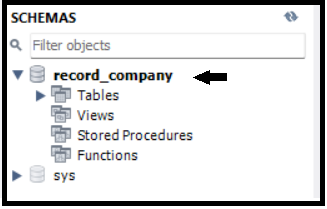

```{css zoom-lib-src, echo = FALSE}
script src = "https://ajax.googleapis.com/ajax/libs/jquery/3.4.1/jquery.min.js"
```

```{js zoom-jquery, echo = FALSE}
 $(document).ready(function() {
    $('body').prepend('<div class=\"zoomDiv\"></div>');
    // onClick function for all plots (img's)
    $('img:not(.zoomImg)').click(function() {
      $('.zoomImg').attr('src', $(this).attr('src')).css({width: '100%'});
      $('.zoomDiv').css({opacity: '1', width: 'auto', border: '1px solid white', borderRadius: '5px', position: 'fixed', top: '50%', left: '50%', marginRight: '-50%', transform: 'translate(-50%, -50%)', boxShadow: '0px 0px 50px #888888', zIndex: '50', overflow: 'auto', maxHeight: '100%'});
    });
    // onClick function for zoomImg
    $('img.zoomImg').click(function() {
      $('.zoomDiv').css({opacity: '0', width: '0%'}); 
    });
  });
```

## Introduction

Hello and welcome to the MySQL personal project!

<center>{width="569"}</center>

In this post, I will design a database about music albums, bands, and songs. After database is created, I inserting a data on each table. Then, I address some of the SQL Query problems to get better understanding of the information.

## Preparation

Here is the preparation required to help finish the MySQL project.

### Tools

To make this project completed, I use SQL for cleaning and analysis. There are many SQL editors where you can design and manipulate a database. For this particular project, I used [MySQL Workbench](https://www.mysql.com/products/workbench/).

### Dataset

The dataset I used in this project is open-source data without any PII (Personally Identifiable Information). I obtain from my favorite web development skills YouTuber, [WebDevSimplified](https://www.youtube.com/@WebDevSimplified/about), and you can watch all of their videos hereThis music dataset contains

[This music dataset](https://github.com/WebDevSimplified/Learn-SQL/blob/master/data.sql) contains detailed information about bands, albums, and songs. This includes three tables that have more than 180 rows. Because the value is being inserted into the table, this dataset is ideal for designing a database from scratch.

## Design a Database

In this section, I will explain how to design a database by inserting a few tables and add a value in each column.

### Create a database

-   To begin, I add and use a new database named **`record_company`** to our MySQL schema.

```{sql STEP 1-1 - Create a record_company database, eval=FALSE, echo=TRUE, message=FALSE, warning=FALSE, paged.print=FALSE}
CREATE DATABASE record_company;
USE record_company;
```

-   Because the **`record_company`** database is already in use, it will appear in the schema with bold text.

<center>{width="35%"}</center>

### Design a table

After creating a database named `record_company`, we try to add a few tables including `bands`, `albums`, and `songs` tables. Here are the steps:

#### Bands table

-   Next, I add the **`bands`** table to our **`record_company`** database. This includes three columns:
    -   `id` to uniquely identify band data input,

    -   `name` for the band's name, and

    -   make `id` our table identifier or Primary Key.

```{sql STEP 2-1 - Create a bands table, eval=FALSE, echo=TRUE, message=FALSE, warning=FALSE, paged.print=FALSE}
CREATE TABLE bands (
  id INT NOT NULL AUTO_INCREMENT,
  name VARCHAR(255) NOT NULL,
  PRIMARY KEY (id)
);
```

#### Albums table

-   After that, I add an **`albums`** table including information on albums they have produced. This includes four columns:
    -   `id` to uniquely identify albums data input,

    -   `name` for the album's name,

    -   `release_year` for the album's year released,

    -   `band_id` for uniquely identifying the band (*same as id on* `bands` *table*), and

    -   Make the `id` of the **`albums`** table the primary key.

    -   Connect `band_id` column from **`albums`** table to the `id` column from **`bands`** table.

```{sql STEP 2-2 - Create an albums table, eval=FALSE, echo=TRUE, message=FALSE, warning=FALSE, paged.print=FALSE}
CREATE TABLE albums (
  id INT NOT NULL AUTO_INCREMENT,
  name VARCHAR(255) NOT NULL,
  release_year INT,
  band_id INT NOT NULL,
  PRIMARY KEY (id),
  FOREIGN KEY (band_id) REFERENCES bands(id)
);
```

#### Songs table

-   Lastly, add **`songs`** table including information on songs they have produced. This includes four columns:
    -   `id` to uniquely identify songs data input,

    -   `name` for the songs' name,

    -   `length` for the duration of the song,

    -   `album_id` for uniquely identifying the album (*same as id on* `albums` *table*).

    -   Make the `id` of the **`songs`** table the primary key.

    -   Connect `album_id` column from **`songs`** table to the `id` column from **`albums`** table.

```{sql STEP 2-3 - Create a songs table, eval=FALSE, echo=TRUE, message=FALSE, warning=FALSE, paged.print=FALSE}
CREATE TABLE songs (
	id INT NOT NULL AUTO_INCREMENT,
    name VARCHAR(255) NOT NULL,
    length FLOAT NOT NULL,
    album_id INT NOT NULL,
    PRIMARY KEY (id),
    FOREIGN KEY (album_id) REFERENCES albums(id)
);
```

Because I already add three tables, it will appear in the schema like this.

<center>{width="35%"}</center>

### Insert the value in the table.

After designing a few tables in the database, I insert a number of values into the table. Here, I will use an `INSERT INTO` function into `bands` table.

```{sql STEP 3-1 - Inserting a bands value, eval=FALSE, echo=TRUE, message=FALSE, warning=FALSE, paged.print=FALSE}
INSERT INTO bands(id,name) VALUES (1,'Seventh Wonder');
INSERT INTO bands(id,name) VALUES (2,'Metallica');
INSERT INTO bands(id,name) VALUES (3,'The Ocean');
INSERT INTO bands(id,name) VALUES (4,'Within Temptation');
INSERT INTO bands(id,name) VALUES (5,'Death');
INSERT INTO bands(id,name) VALUES (6,'Van Canto');
INSERT INTO bands(id,name) VALUES (7,'Dream Theater');
```

Because the dataset has a large number of rows, I will include another table [in this file](https://github.com/WebDevSimplified/Learn-SQL/blob/master/data.sql) thanks to [WebDevSimplified](https://www.youtube.com/@WebDevSimplified/about).

## SQL Query Problem

In this section, I will use some of SQL Query to answer a few question. This will helps us to get better understanding of the dataset.

### How many bands in this dataset?

<details>

<summary><b>Query</b></summary>

```{sql STEP 4-1 - How many bands?, eval=FALSE, echo=TRUE, message=FALSE, warning=FALSE, paged.print=FALSE}
SELECT bands.name AS 'Band Name'
FROM bands;
```

</details>

Here are all the bands that included in this dataset.

<center>{width="35%"}</center>

### Which is the oldest album?

<details>

<summary><b>Query</b></summary>

```{sql STEP 4-2 - Oldest album?, eval=FALSE, echo=TRUE, message=FALSE, warning=FALSE, paged.print=FALSE}
SELECT name AS 'Album Name', release_year FROM albums
WHERE release_year IS NOT NULL
ORDER BY release_year
LIMIT 1;
```

</details>

Here is the oldest album in this dataset.

<center>{width="30%"}</center>

### Which bands have released at least one album?

<details>

<summary><b>Query</b></summary>

```{sql STEP 4-3 - Band that have at least one album?, eval=FALSE, echo=TRUE, message=FALSE, warning=FALSE, paged.print=FALSE}
SELECT DISTINCT bands.name AS 'Band Name' FROM bands
RIGHT JOIN albums ON albums.band_id = bands.id;
```

</details>

Here are the list of all bands that have released at least one album in this dataset.

<center>{width="30%"}</center>

### Which bands that have no album?

<details>

<summary><b>Query</b></summary>

```{sql STEP 4-4 - Band that have no album?, eval=FALSE, echo=TRUE, message=FALSE, warning=FALSE, paged.print=FALSE}
SELECT b.name AS 'Band Name' FROM bands AS b
LEFT JOIN albums AS a ON a.band_id = b.id
GROUP BY a.band_id
HAVING COUNT(a.id) = 0;
```

</details>

Here are the list of all bands that have no album in this dataset.

<center>{width="30%"}</center>

### Longest album duration?

<details>

<summary><b>Query</b></summary>

```{sql STEP 4-5 - Band with the longest album duration, eval=FALSE, echo=TRUE, message=FALSE, warning=FALSE, paged.print=FALSE}
SELECT a.name 'Album Name', a.release_year AS 'Release Year', SUM(s.length) AS 'Duration' FROM songs AS s
LEFT JOIN albums AS a ON s.album_id = a.id
WHERE a.release_year IS NOT NULL
GROUP BY a.id
ORDER BY SUM(s.length) DESC
LIMIT 1;
```

</details>

Here are the band with the longest album duration.

<center>{width="30%"}</center>

### Update the album data with no release year

Here are the steps to updating the album data with no release year:

-   First, look for albums that have no release year.

<details>

<summary><b>Query</b></summary>

```{sql STEP 4-6.1 - Update the album data with no release year, eval=FALSE, echo=TRUE, message=FALSE, warning=FALSE, paged.print=FALSE}
SELECT name, release_year FROM albums
WHERE release_year IS NULL;
```

</details>

<center>{width="30%"}</center>

-   There's an albums with no release year (null value), update the value to 1982.

<details>

<summary><b>Query</b></summary>

```{sql STEP 4-6.2 - Update the album data with no release year, eval=FALSE, echo=TRUE, message=FALSE, warning=FALSE, paged.print=FALSE}
UPDATE albums
SET release_year = 1982
WHERE release_year IS NULL;
```

</details>

-   Re-check again the value that has been updated.

<details>

<summary><b>Query</b></summary>

```{sql STEP 4-6.3 - Update the album data with no release year, eval=FALSE, echo=TRUE, message=FALSE, warning=FALSE, paged.print=FALSE}
SELECT name, release_year FROM albums
WHERE release_year IS NULL;
```

</details>

<center>{width="30%"}</center>

-   Because there is **no null or empty value** in the `release_year` column, the result will be empty.

### Delete the album you updated before

Here are the steps to updating the album data with no release year:

-   First, look for albums that have '1982' in `release_year` column.

<details>

<summary><b>Query</b></summary>

```{sql STEP 4-7.1 - Check albums that have 1982 in release_year column, eval=FALSE, echo=TRUE, message=FALSE, warning=FALSE, paged.print=FALSE}
SELECT id, name, release_year FROM albums
WHERE release_year = 1982;
```

</details>

-   There is an album that has previously been updated; delete it with its album name using `id` column.

<details>

<summary><b>Query</b></summary>

```{sql STEP 4-7.2 - Delete updated albums with its album name, eval=FALSE, echo=TRUE, message=FALSE, warning=FALSE, paged.print=FALSE}
DELETE FROM albums
WHERE id = 4;
```

</details>

-   Re-check again the value that has been deleted.

-   If there's any problem with deleting the value, go refer to [this discussion](https://findnerd.com/list/view/ERROR-1451-23000-Cannot-delete-or-update-a-parent-row-a-foreign-key-constraint/1133/).

### Average length of all songs

<details>

<summary><b>Query</b></summary>

```{sql STEP 4-8 - Average songs duration, eval=FALSE, echo=TRUE, message=FALSE, warning=FALSE, paged.print=FALSE}
SELECT AVG(length) AS 'Average Song Duration (in min)' 
FROM songs;
```

</details>

Here are the average duration of all song.

<center>{width="30%"}</center>

### Which song on each album is the longest?

<details>

<summary><b>Query</b></summary>

```{sql STEP 4-9 - Longest songs each album, eval=FALSE, echo=TRUE, message=FALSE, warning=FALSE, paged.print=FALSE}
SELECT a.name AS 'Album Name', s.name AS 'Song Name', a.release_year AS 'Release Year', MAX(s.length) AS 'Duration' FROM albums AS a
INNER JOIN songs as s ON a.id = s.album_id
GROUP BY a.id;
```

</details>

Here are the longest song of each album with its release year.

<center>{width="60%"}</center>

### Get the number of songs for each band

<details>

<summary><b>Query</b></summary>

```{sql STEP 4-10 - Total songs each bands, eval=FALSE, echo=TRUE, message=FALSE, warning=FALSE, paged.print=FALSE}
SELECT b.name AS 'Band Name', COUNT(s.id) AS 'Number of Songs' 
FROM bands AS b
JOIN albums AS a ON a.band_id = b.id
JOIN songs AS s ON s.album_id = a.id
GROUP BY b.name;
```

</details>

Here are the total songs counted for each band.

<center>

{width="40%"}

</center>

## Appendix

-   WebDevSimplified [[YouTube](https://www.youtube.com/@WebDevSimplified), [GitHub](https://github.com/WebDevSimplified/Learn-SQL)]

-   [Kaggle Full Script](https://www.kaggle.com/miftahulhadii)
