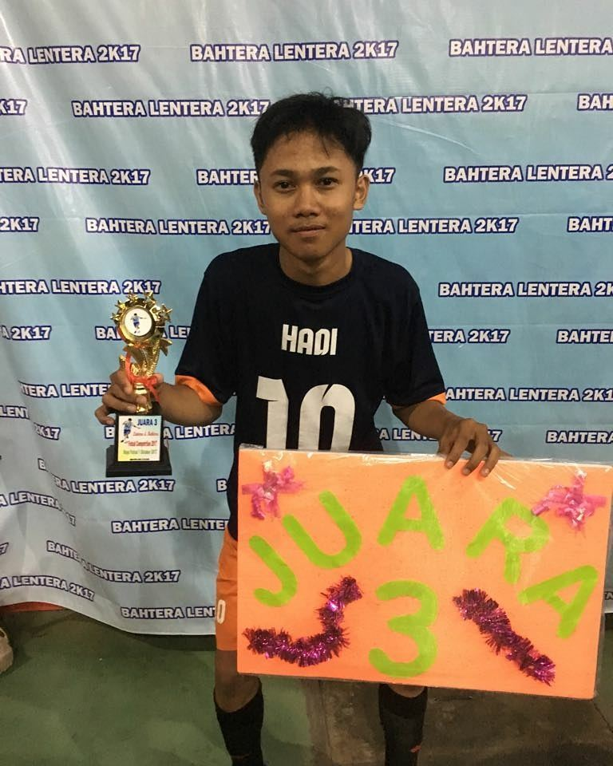

```{r setup, include=FALSE}
knitr::opts_chunk$set(echo = FALSE)
library(distilltools)
```

Welcome to my personal website! I am a +6 months of experience as a data analyst in a social-tech company. Practiced experience in data cleaning, visualization, and analysis with R, SQL, Tableau, and communication. He working on personal projects over different cases in data analysis. Attending online courses and reading books to leverage my knowledge. You can also see more about my background on my resume:

<center>
```{r, echo=FALSE}
icon_link(
    text = "Resume",
    url  = "https://docs.google.com/document/d/1ySz7KR_ZjWB4NO6u24l9M9BfP6VDiU8m/edit?usp=sharing&ouid=104673057248975950615&rtpof=true&sd=true"
)
```
</center>

### Short Bio
Welcome to my personal website! I am a +6 months of experience as a data analyst in a social-tech company. Practiced experience in data cleaning, visualization, and analysis with R, SQL, Tableau, and communication. He working on personal projects over different cases in data analysis. Attending online courses and reading books to leverage my knowledge.

### `r make_icon("fab fa-r-project")` Programming
Welcome to my personal website! I am a +6 months of experience as a data analyst in a social-tech company. Practiced experience in data cleaning, visualization, and analysis with R, SQL, Tableau, and communication. He working on personal projects over different cases in data analysis. Attending online courses and reading books to leverage my knowledge.

### College Life
{width=80% .external}

Welcome to my personal website! I am a +6 months of experience as a data analyst in a social-tech company. Practiced experience in data cleaning, visualization, and analysis with R, SQL, Tableau, and communication. He working on personal projects over different cases in data analysis. Attending online courses and reading books to leverage my knowledge.

### Mountaineering
{width=80% .external}

Welcome to my personal website! I am a +6 months of experience as a data analyst in a social-tech company. Practiced experience in data cleaning, visualization, and analysis with R, SQL, Tableau, and communication. He working on personal projects over different cases in data analysis. Attending online courses and reading books to leverage my knowledge.

### Futsal
{width=50% .external}

Welcome to my personal website! I am a +6 months of experience as a data analyst in a social-tech company. Practiced experience in data cleaning, visualization, and analysis with R, SQL, Tableau, and communication. He working on personal projects over different cases in data analysis. Attending online courses and reading books to leverage my knowledge.

Thanks for visiting my personal website, don't hesitate to give a feedback you may have!

Best,

Hadi