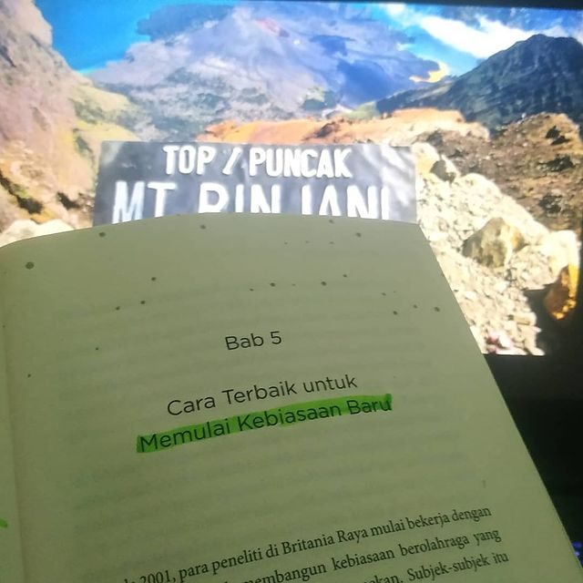

```{r setup, include=FALSE}
knitr::opts_chunk$set(echo = FALSE)
library(distilltools)
```

Welcome to my personal website! I am a +6 months of experience as a data analyst in a social-tech company. Practiced experience in data cleaning, visualization, and analysis with R, SQL, Tableau, and communication. He working on personal projects over different cases in data analysis. Attending online courses and reading books to leverage my knowledge. You can also see more about my background on my resume:

<center>
```{r, resume icon, echo=FALSE}
icon_link(
    text = "Resume",
    url  = "https://docs.google.com/document/d/1ySz7KR_ZjWB4NO6u24l9M9BfP6VDiU8m/edit?usp=sharing&ouid=104673057248975950615&rtpof=true&sd=true"
)
```
</center>

### Short Bio
Miftahul Hadi is an ex Data Analyst at social-tech company, Campaign.com. His project focus on understanding how consumer preferences are based on app growth. He also focus on evaluating business project budget using financial analysis. He takes a course on financial analysis,  data science, digital marketing, and analytical tools. He has expertise in choice modeling, exploratory data analysis, and cleaning a database. He is well-written in English and has implied it to the work environment at Campaign.com. Hadi holds a B.Sc in physics from the Faculty of Mathematics and Natural Sciences at Sumatera Institute of Technology.

### `r make_icon("fab fa-r-project")` Programming
I use `r make_icon("fab fa-r-project")` for my quantitative research projects. `r make_icon("fab fa-r-project")` has a good feature in cleaning and crafting a data visualization. I leverage `tidyverse` library for exploratory data analysis. This library includes `ggplot2` which is beneficial to craft a data viz that can be shared and reproduced with peers using **R Markdown**. 

In addition to R Markdown, I leverage this to create a portfolio website. To convert R Markdown to website, I utilize [distill](https://rstudio.github.io/distill/) library and [GitHub Pages](https://pages.github.com/) to reformat the Markdown into web. I also see the other guide for website thanks to [John Paul](https://www.jhelvy.com/about.html).

You can see [others R project](project.html#category:R_Programming) on this website.


### College Life
{width=80% .external}

I began studying Physics at ITERA as an undergraduate in the mid of 2017. I work as an assistant in practicum and lessons in Fundamental of Physics class for 2.5 years. This provides an opportunity to increase my communication & presenting skills in front of at least 40 college student. 

During the thesis, I choose to work on Computational Physics. It was developing Magneto-resistive Random Access Memory (MRAM) using C++ programming languages with [OOMMF](https://math.nist.gov/oommf/). Then, this project is presented on 11th ICTAP Physical Society of Indonesia in front of others Physicians.

### Mountaineering
{width=80% .external}

I love to do a hike to exercise my body with my friends. I also love this because we have to carefully organize the transportation to get there and what food, cloth, & other to bring. This activity helps me to be grateful for everything.

### Books as a hobby
{width=50% .external}

Before a sleep, read a books helps me to reduce stress. Books has a power to transport you to the authors world and away from the monotonous daily routine. Reading a variety of topics helps me to be more knowledgeable person, in turn improving my conversation skills.

Thanks for visiting my personal website, don't hesitate to give a feedback you may have!

Best,

Hadi